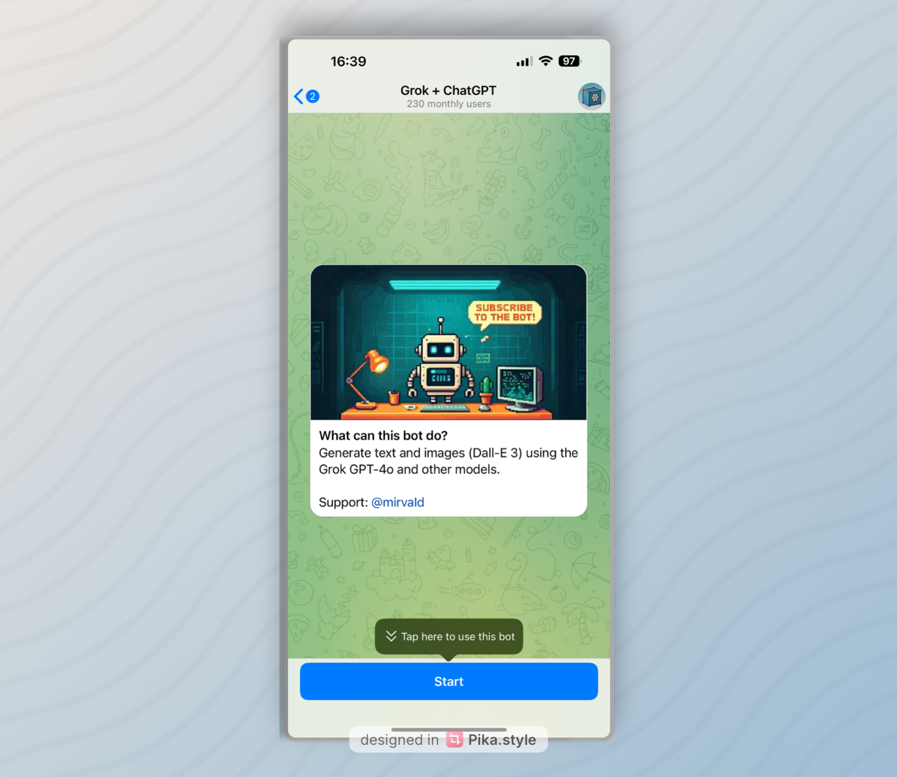

# AIHelper Bot


My Telegram bot providing access to modern AI models (GPT-4O, Claude) directly in your messenger. Created for convenient work with neural networks without unnecessary complications.

## Features

- **Multiple AI Models**: support for ChatGPT and Claude
- **Content Generation**:
  - Text responses with context memory
  - Image analysis and description
- **User Management**:
  - Token-based economy
  - Daily free tokens
  - Referral system
- **Multilingual Support**: Russian, English, and Ukrainian interfaces
- **Admin Panel**: for monitoring and management

## Installation

1. Clone the repository
```bash
git clone https://github.com/yourusername/aihelper-bot.git
cd aihelper-bot
```

2. Install dependencies
```bash
pip install -r requirements.txt
```

3. Create a `.env` file with the necessary environment variables

4. Run the bot
```bash
python main.py
```

## Environment Variables

```env
# API Keys for models
OPENAI_API_KEY=sk-your_openai_key
ANTHROPIC_API_KEY=your_anthropic_key

# Model settings
GPT_MODEL=gpt-4o
CLAUDE_MODEL=claude-3-7-sonnet-20250219

# Telegram and MongoDB settings
BOT_TOKEN=your_telegram_bot_token
MONGO_URL=your_mongodb_url

# Webhook settings
PORT=8443
WEBHOOK_URL=https://your_domain
```

## Bot Commands

- `/start` - start working with the bot
- `/models` - select AI model

- `/invite` - get a referral link
- `/profile` - information about your profile and balance
- `/reset` - reset conversation history (context)
- `/help` - get help on using the bot

## Architecture

The bot is built on a modern technology stack:

- **aiogram 3.x** - for interacting with Telegram API
- **MongoDB** (motor) - asynchronous database operations
- **OpenAI API** - for access to GPT-4O
- **Anthropic API** - for integration with Claude
- **APScheduler** - for executing scheduled tasks

## Project Structure

```
aihelper-bot/
├── bot/
│   ├── database/        # MongoDB operations
│   ├── handlers/        # Command handlers
│   ├── keyboards/       # Bot keyboards
│   ├── locales/         # Multilingual support
│   ├── services/        # AI services integration
│   └── utils/           # Helper functions
├── config.py            # Project configuration
├── main.py              # Main entry file
└── requirements.txt     # Dependencies
```

## License

MIT

## Contact

If you have any questions or suggestions for improving the bot, contact me via [Telegram](https://t.me/mirvaId).